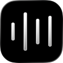

<div align="center">

  

  <h1><code>rtaudio</code></h1>

  <p>
    <strong>A hyper-optimized, GPU-accelerated macOS system audio visualizer inspired by Apple's Dynamic Island.</strong>
  </p>

  <p>
    <a href="#license"></a>
  </p>

</div>

---

## 🌟 Authors

- [@zeph](https://github.com/ZephyrCodesStuff) (that's me!)

## ⚠️ READ ME: "I can't run the app!"

By default, you might not be able to open the app. This is because of macOS's _Gatekeeper_ feature, blocking the app from running since it's not signed by a paid Apple Developer account's certificate.

Don't worry, **you can easily bypass this**! To open the app, you need to:

1. Drag and drop the app into your **Applications** folder
2. Open a terminal
3. Run the following command:

```bash
xattr -d com.apple.quarantine /Applications/rtaudio.app
```

After doing this, you should be able to open the app without any issues!

## 📖 Overview

**rtaudio** is a computationally invisible, real-time macOS system audio visualizer. It drops deep into the macOS hardware stack to capture targeted application audio via kernel-level CoreAudio taps, performs a hardware-accelerated Fast Fourier Transform (FFT) in C++, and renders a buttery-smooth waveform entirely on the GPU using custom Metal fragment shaders.

> ℹ️ **Info**: `rtaudio` is _not really a "final product"_ but more of a _highly-optimized proof-of-concept_ for real-time audio visualization on macOS.
>
> The app bypasses SwiftUI entirely to avoid `AttributeGraph` diffing overhead. The real magic is how it hands 100% of the UI rendering to the GPU, making it possible to run an accurate remake of Apple's waveform visualizer at near-zero CPU cost—even on battery power at 120Hz.
>
> **Feel free to include its techniques in your own project** (but _please give credit!_)

## ⚡ Performance

`rtaudio` is engineered to be a **zero-overhead background utility**. It blends seamlessly into your system's idle baseline, making it perfect for "Dynamic Island" style overlays that run constantly on MacBooks without draining the battery.

Benchmarks using "Release" build mode currently show:

- **CPU Usage**: Effectively hovering around **~4%** Wall Clock time while actively rendering at a full 120Hz on ProMotion displays.
- **Hardware-Synced Refresh**: Leverages optimized `MTKView` display links to perfectly match your active monitor's refresh rate, dropping to 60Hz on external displays to save power.
- **Zero-Draw Bailout**: The Metal draw loop automatically detects audio silence and suspends GPU encoding. When music is paused, GPU usage flatlines to **0.0%**.
- **Pause when Hidden**: Hooks into `NSWindow.occlusionState` to automatically freeze the CoreAudio tap when the visualizer is covered or the screen locks.
- **Audio Processing**: Accelerate (`vDSP`) SIMD operations process 1024-sample mono FFTs and peak detection in fractions of a millisecond.

## 🔧 Features & Tech Stack

### Core Features

| Feature                 | Description                                                                                                                        |
| :---------------------- | :--------------------------------------------------------------------------------------------------------------------------------- |
| **Dynamic Island UI**   | Features Apple's true OLED-black backgrounds and mathematically perfect SDF rendering.                                             |
| **Event-Driven Colors** | Listens to Apple Music via `NSDistributedNotificationCenter` to extract dominant artwork colors and dynamically tint the bars.     |
| **SDF Metal Shaders**   | Bypasses the CPU for UI rendering. The GPU calculates waveform pixels and animated blurs in parallel using Signed Distance Fields. |
| **CoreAudio Tap**       | Scans `NSWorkspace` to only tap audio from specific running apps (Apple Music, Spotify).                                           |

### Technologies Used

| Component            | Technology                                            |
| :------------------- | :---------------------------------------------------- |
| **Audio Capture**    | `CoreAudio` (`CATap` / Aggregate Devices)             |
| **DSP & FFT**        | `Accelerate` / `vDSP` (C++)                           |
| **Rendering**        | `Metal` (`MTKView` / MSL Shaders / SDFs)              |
| **State Management** | `AppKit` (`NSWindowDelegate` occlusion / DisplayLink) |
| **Inter-Process**    | `AppleScript` / `NSDistributedNotificationCenter`     |

## 💿 Getting Started

### Prerequisites

- macOS 14.2+ (Required for public `AudioHardwareCreateProcessTap` support)
- Xcode 15+

### Building & Running

1. Clone the repository and open `rtaudio.xcodeproj` in Xcode.
2. Build and Run (`Cmd + R`).

> **Tip:** macOS treats kernel-level audio taps exactly like physical microphones. The OS will automatically prompt you for Microphone permissions on the first run. You may need to restart the app after granting permission!

## 💛 Contributions

Contributions are welcome! Since this project aims for hyper-efficiency:

1. Please ensure any UI additions are written as `MSL` shaders. Do not introduce SwiftUI or Core Animation layers that require CPU geometry calculation.
2. Keep audio processing allocations strictly outside of the C++ `process()` loop to prevent audio dropouts.
3. Make sure your PR contains all the details needed to know what you're changing and why.

## 📄 License

This project is licensed under the **MIT License**.

**What this means:**

- ✅ **You can** use this code in your own projects.
- ✅ **You can** modify the tool to suit your needs.
- ✅ **You can** distribute closed-source versions.

See [LICENSE](LICENSE) for more details.
